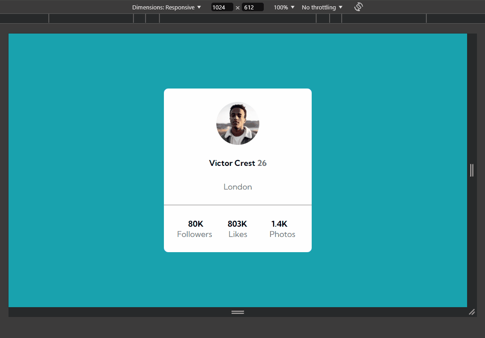

# 🚀 Replicando uma Página Web - Exercício DevQuest
## 👋 Apresentação

Olá! Me chamo Miguel, e estou em minha jornada como aspirante a Desenvolvedor Web. Este projeto marca a minha primeira tentativa de replicar uma página web do zero, sem ajuda direta, e eu gostaria de compartilhar o processo com você.  
Escrevo este README como uma espécie de diário técnico, contando sobre o que aprendi, revisei e os desafios que enfrentei ao longo do caminho. Este desafio faz parte do módulo de CSS Avançado do curso DevQuest da Dev em Dobro. 🎯

## 💻 Explicação do Projeto
Este é um projeto simples e responsivo, cujo foco é a criação de um cartão de perfil social. A página conta com um fundo azul que ocupa toda a área visível do navegador. No centro da tela, temos um contêiner branco que funciona como um cartão profissional, apresentando as informações da pessoa.

**Dentro do cartão, é possível ver:**

- 📷 Uma foto de perfil circular;
- 🧑‍💼 Nome, idade e cidade da pessoa;
- 📊 Estatísticas da rede social (número de seguidores, curtidas e fotos).

A ideia principal desta aplicação é exibir essas informações de forma clara e profissional. O layout é simples, mas a estilização CSS e a disposição dos elementos buscam criar uma aparência moderna e minimalista. Você pode visualizar o design na GIF que anexei abaixo.

  

  

## 🛠️ Linguagens Utilizadas

 
  
  
  

## 🧗‍♂️ Desafios Enfrentados
Durante o desenvolvimento, o maior desafio foi na estruturação do código HTML. Minha primeira tentativa resultou em uma organização um pouco confusa, especialmente quando comparei com a versão de um desenvolvedor mais experiente. Tive dificuldades na escolha das tags adequadas e em nomear corretamente as classes CSS, o que impactou diretamente na clareza do código.

Apesar dessas dificuldades, consegui replicar a página sem recorrer à solução oficial. Posteriormente, comparei meu código com a solução fornecida e refinei várias partes, melhorando a estrutura e tornando o código mais limpo e legível. ✅

## 📚 O Que Aprendi com Este Desafio
Este projeto foi uma excelente oportunidade para reforçar meu entendimento sobre Flexbox e suas propriedades, especialmente no que diz respeito ao alinhamento e posicionamento de elementos em containers flexíveis. Ademais, revisitei importantes conceitos que envolvem a organização de pastas de um projeto e o versionamento de código utilizando o GitHub. Outro ponto de destaque foi relembrar como utilizar o Markdown, que precisei revisar para escrever este README.

Além disso, aprendi a fazer um elemento ocupar toda a altura do viewport, manipular a forma dos elementos (como criar imagens circulares), e aprofundei meu conhecimento em cores CSS, utilizando o valor rgba para controlar a opacidade de determinados elementos. 🎨🔧

## 🎉 Conclusão
Se você chegou até aqui, agradeço por dedicar seu tempo para conhecer o meu diário técnico. Este desafio foi um grande passo na minha jornada de aprendizado, e ainda há muito o que explorar e melhorar. 🙌

  

    
    
  

  

